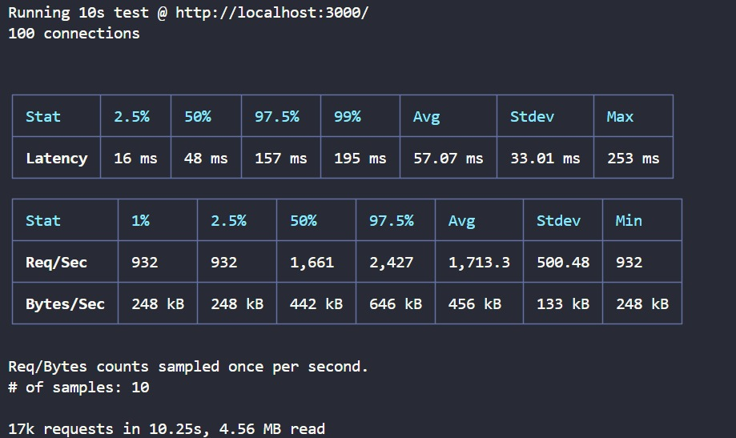
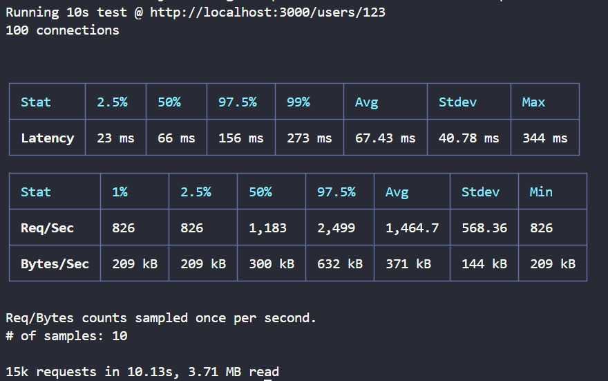
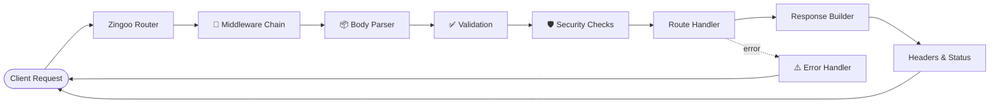

<div align="center">


<br/>


<br/>

[](#)
[](#)
[](#)
[](#)
[](#)

</div>

<br/>

<table align="center">
<tr>
<td>

> **TL;DR** — Zingoo is a **TypeScript-first, lightweight Node.js HTTP framework** that replaces Express boilerplate with sensible defaults. Secure by default. Type-safe end-to-end. Built for the modern backend stack.

</td>
</tr>
</table>

<div align="center">

### 📚 Documentation

**[Getting Started](#-quick-start)** · **[What's Shipped](#-whats-in-v010)** · **[Benchmarks](#-benchmarks)** · **[Core Concepts](#-core-concepts)** · **[API Reference](#-api-reference)** · **[Roadmap](#-roadmap)** · **[Contributing](#-contributing)**

</div>

---

<br/>

## 📖 Table of Contents

<details open>
<summary><b>Click to expand</b></summary>

- [What is Zingoo?](#-what-is-zingoo)
- [What's in v0.1.0](#-whats-in-v010)
- [Benchmarks](#-benchmarks)
- [Core Concepts](#-core-concepts)
  - [HTTP Server & Router](#-http-server--router)
  - [Middleware & Flow Control](#-middleware--flow-control)
  - [Request & Response Abstraction](#-request--response-abstraction)
  - [Body Parsing & Validation](#-body-parsing--validation)
  - [Security Defaults](#️-security-defaults)
  - [Error Handling](#-error-handling)
  - [Logging & DX](#-logging--dx)
- [Architecture](#️-architecture)
- [Quick Start](#-quick-start)
- [API Reference](#-api-reference)
- [Roadmap](#-roadmap)
- [Contributing](#-contributing)

</details>

<br/>

## 🌌 What is Zingoo?

Zingoo is a **TypeScript-first, modern Node.js HTTP framework** designed as a lean, type-safe alternative to Express. It ships with routing, middleware, validation, security headers, CORS, rate limiting, and structured error handling — all with a clean, minimal API.

**v0.1.0 ships the core framework.** Future versions will add AI/LLM support, RAG pipelines, and observability as first-class features.

```diff
+ npm install zingoo
```

<br clear="right"/>

---

## ✨ What's in v0.1.0

<div align="center">

| ✅ Shipped | 🚧 Coming Soon |
|:---:|:---:|
| HTTP Server & Router | AI / LLM Engine |
| Middleware System | RAG Pipelines |
| Request/Response APIs | Observability Dashboard |
| Body Parsing & Validation | Database Layer |
| Security Defaults | Plugin Marketplace |
| Error Handling | Auto-generated CRUD |
| Testing Framework (44/44 ✅) | Performance Benchmarks |

</div>

### 🎯 v0.1.0 Feature Checklist

#### 🌐 Core

- ✅ Application factory (`zingoo()`)
- ✅ Native Node `http` server
- ✅ Route registration (GET, POST, PUT, PATCH, DELETE, OPTIONS, HEAD)
- ✅ Static & dynamic routes
- ✅ Route parameters (`:id`, multiple params)
- ✅ Static route priority
- ✅ Nested/mounted routers
- ✅ Global & router-level middleware
- ✅ Middleware `next()` chaining

#### 🔄 Request / Response

- ✅ Request abstraction layer
- ✅ Headers, query params, path, IP detection
- ✅ Route parameter extraction
- ✅ Response abstraction layer
- ✅ JSON responses, status codes
- ✅ Response helpers & termination

#### 📦 Body & Validation

- ✅ JSON body parser
- ✅ URL-encoded body parser
- ✅ Text body parser
- ✅ Configurable body size limits
- ✅ Invalid JSON error handling
- ✅ Built-in validation
- ✅ Body, query, and params validation

#### 🛡️ Security

- ✅ Security headers (Helmet-inspired defaults)
- ✅ CORS configuration
- ✅ Rate limiting (customizable)

#### ⚠️ Errors

- ✅ `ZingooError` class
- ✅ Global error handler
- ✅ Development vs. production-safe responses
- ✅ Custom error handler support

#### 🧪 Developer Experience

- ✅ Built-in logger
- ✅ Request logging
- ✅ Public API & examples
- ✅ Full TypeScript support
- ✅ **44/44 tests passing** ✅

---

## 📊 Benchmarks

Early performance numbers for **Zingoo v0.1.0**. These are first-pass benchmarks — a dedicated benchmarking suite is planned for a future release (see [Roadmap](#-roadmap)).

<div align="center">



<br/><br/>



</div>


---

## 🧩 Core Concepts

<br/>

### 🌐 HTTP Server & Router

Create an app and register routes with a familiar API:

```ts
import zingoo from "zingoo";

const app = zingoo();

app.get("/", (req, res) => {
  res.json({ message: "Welcome to Zingoo ⚡" });
});

app.post("/users", (req, res) => {
  const { name, email } = req.body;
  res.json({ id: 1, name, email });
});

app.listen(3000);
```

Supports all HTTP methods:

```ts
app.get(path, handler);
app.post(path, handler);
app.put(path, handler);
app.patch(path, handler);
app.delete(path, handler);
app.options(path, handler);
app.head(path, handler);
```

Dynamic route parameters:

```ts
app.get("/users/:id", (req, res) => {
  const { id } = req.params;
  res.json({ user: { id } });
});

app.get("/posts/:postId/comments/:commentId", (req, res) => {
  const { postId, commentId } = req.params;
  res.json({ postId, commentId });
});
```

Mount nested routers:

```ts
const userRouter = zingoo.Router();
userRouter.get("/:id", (req, res) => { /* ... */ });
userRouter.post("/", (req, res) => { /* ... */ });

app.mount("/users", userRouter);
// Routes: GET /users/:id, POST /users
```

<br/>

### 🔄 Middleware & Flow Control

Register global middleware:

```ts
app.use((req, res, next) => {
  console.log(`${req.method} ${req.path}`);
  next();
});

app.use((req, res, next) => {
  req.user = { id: 1 }; // Attach data to request
  next();
});
```

Router-level middleware:

```ts
const apiRouter = zingoo.Router();

apiRouter.use((req, res, next) => {
  if (!req.headers.authorization) {
    return res.status(401).json({ error: "Unauthorized" });
  }
  next();
});

apiRouter.get("/profile", (req, res) => {
  res.json({ user: req.user });
});

app.mount("/api", apiRouter);
```

Middleware runs in registration order and respects `next()`.

<br/>

### 🚀 Request & Response Abstraction

**Request object:**

```ts
app.get("/search", (req, res) => {
  const query = req.query.q;           // Query params
  const method = req.method;           // HTTP method
  const path = req.path;               // Request path
  const headers = req.headers;         // Headers
  const ip = req.ip;                   // Client IP
  const body = req.body;               // Parsed body
  const { id } = req.params;           // Route params
});
```

**Response object:**

```ts
app.get("/", (req, res) => {
  res.status(200);                     // Set status
  res.setHeader("X-Custom", "value");  // Set headers
  res.json({ data: "value" });         // JSON response
  // OR
  res.send("plain text");              // Plain text
  // OR
  res.end();                           // End without body
});
```

<br/>

### 📦 Body Parsing & Validation

Automatic body parsing for common content types:

```ts
app.post("/users", (req, res) => {
  // req.body is automatically parsed
  const { name, email } = req.body;
  res.json({ name, email });
});
```

Supports:
- `application/json`
- `application/x-www-form-urlencoded`
- `text/plain`

Configurable size limits:

```ts
const app = zingoo({
  bodyLimit: "10mb"
});
```

Built-in validation:

```ts
const validateUser = (body) => {
  if (!body.name || typeof body.name !== "string") {
    throw new ZingooError("Invalid name", 400);
  }
  if (!body.email || !body.email.includes("@")) {
    throw new ZingooError("Invalid email", 400);
  }
};

app.post("/users", (req, res) => {
  validateUser(req.body);
  res.json({ user: req.body });
});
```

<br/>

### 🛡️ Security Defaults

Enable security headers automatically:

```ts
const app = zingoo({
  security: {
    headers: true,
    cors: true,
    rateLimit: true
  }
});
```

**Security headers** (enabled by default):
- `X-Content-Type-Options: nosniff`
- `X-Frame-Options: DENY`
- `X-XSS-Protection: 1; mode=block`
- `Referrer-Policy: strict-origin-when-cross-origin`
- `Permissions-Policy: geolocation=(), microphone=(), camera=()`

**CORS:**

```ts
const app = zingoo({
  cors: {
    origin: ["http://localhost:3000", "https://example.com"],
    methods: ["GET", "POST", "PUT", "DELETE"],
    credentials: true
  }
});
```

**Rate Limiting:**

```ts
const app = zingoo({
  rateLimit: {
    windowMs: 15 * 60 * 1000,  // 15 minutes
    max: 100                    // 100 requests per window
  }
});
```

<br/>

### ⚠️ Error Handling

Zingoo includes a `ZingooError` class for structured errors:

```ts
import { ZingooError } from "zingoo";

app.get("/users/:id", (req, res) => {
  if (!req.params.id) {
    throw new ZingooError("User ID required", 400);
  }
  res.json({ id: req.params.id });
});
```

Global error handler (catches thrown errors):

```ts
app.on("error", (err, req, res) => {
  console.error(err);
  res.status(err.status || 500).json({
    error: err.message,
    ...(process.env.NODE_ENV === "development" && { stack: err.stack })
  });
});
```

Production-safe error responses:

```ts
// Development: returns full stack trace
// Production: returns safe message only
```

<br/>

### 🧪 Logging & DX

Built-in logger for debugging:

```ts
app.use((req, res, next) => {
  console.log(`→ ${req.method} ${req.path}`);
  next();
});

// Output:
// → GET /users
// → POST /users
// → GET /users/1
```

Full TypeScript support throughout:

```ts
interface User {
  id: number;
  name: string;
  email: string;
}

app.get("/users/:id", (req, res): void => {
  const user: User = { id: 1, name: "Alice", email: "alice@example.com" };
  res.json(user);
});
```

---

## 🗺️ Architecture



<details>
<summary>📦 Modular package structure</summary>

```
zingoo (umbrella export)
├── @zingoo/core         (app factory, router)
├── @zingoo/http         (request/response)
├── @zingoo/parser       (body parsing)
├── @zingoo/validation   (error class, validators)
├── @zingoo/security     (headers, CORS, rate limit)
├── @zingoo/error        (error handler)
└── @zingoo/logger       (logging utilities)

Upcoming:
├── @zingoo/ai           (LLM support)
├── @zingoo/rag          (RAG pipelines)
├── @zingoo/observability (metrics, tracing)
├── @zingoo/database     (ORM helpers)
└── @zingoo/plugins      (plugin system)
```

</details>

---

## 🚀 Quick Start

```bash
npm install zingoo
```

```ts
import zingoo from "zingoo";

const app = zingoo({
  security: {
    headers: true,
    cors: true,
    rateLimit: true
  }
});

// Global middleware
app.use((req, res, next) => {
  console.log(`${req.method} ${req.path}`);
  next();
});

// Routes
app.get("/", (req, res) => {
  res.json({ message: "Welcome to Zingoo ⚡" });
});

app.post("/api/users", (req, res) => {
  const { name, email } = req.body;
  res.status(201).json({ id: 1, name, email });
});

app.get("/api/users/:id", (req, res) => {
  const { id } = req.params;
  res.json({ id, name: "Alice", email: "alice@example.com" });
});

// Start server
app.listen(3000, () => {
  console.log("Zingoo server running on http://localhost:3000");
});
```

```bash
node server.ts
```

---

## 🧾 API Reference

<details>
<summary><b>Expand full reference</b></summary>

### Application

| Method | Signature | Description |
|---|---|---|
| `zingoo()` | `zingoo(options?)` | Create app instance |
| `app.listen()` | `(port, callback?)` | Start HTTP server |
| `app.use()` | `(middleware)` | Register global middleware |
| `app.on()` | `(event, handler)` | Listen for app events (e.g., `error`) |

### Routing

| Method | Signature | Description |
|---|---|---|
| `app.get()` | `(path, handler)` | Register GET route |
| `app.post()` | `(path, handler)` | Register POST route |
| `app.put()` | `(path, handler)` | Register PUT route |
| `app.patch()` | `(path, handler)` | Register PATCH route |
| `app.delete()` | `(path, handler)` | Register DELETE route |
| `app.options()` | `(path, handler)` | Register OPTIONS route |
| `app.head()` | `(path, handler)` | Register HEAD route |
| `app.mount()` | `(path, router)` | Mount nested router |
| `zingoo.Router()` | `()` | Create nested router instance |

### Request

| Property | Type | Description |
|---|---|---|
| `req.method` | `string` | HTTP method |
| `req.path` | `string` | Request path |
| `req.query` | `object` | Query parameters |
| `req.params` | `object` | Route parameters |
| `req.headers` | `object` | HTTP headers |
| `req.body` | `any` | Parsed body |
| `req.ip` | `string` | Client IP address |

### Response

| Method | Signature | Description |
|---|---|---|
| `res.status()` | `(code: number)` | Set HTTP status |
| `res.json()` | `(data: any)` | Send JSON response |
| `res.send()` | `(data: string \| Buffer)` | Send text response |
| `res.setHeader()` | `(name, value)` | Set response header |
| `res.end()` | `()` | End response |

### Error Handling

| Class | Description |
|---|---|
| `ZingooError` | Custom error class with status code |

```ts
throw new ZingooError("User not found", 404);
```

</details>

---

## 🧭 Roadmap

<div align="center">

### v0.1.0 ✅ COMPLETE
**HTTP Framework, Routing, Middleware, Security, Error Handling**

### v0.2.0 🚧 IN PROGRESS
**Type Safety & Advanced Validation**

### v0.3.0 ⏳ PLANNED
**AI / LLM Engine (Groq, OpenAI, etc.)**

### v0.4.0 ⏳ PLANNED
**Database Layer (MongoDB, PostgreSQL adapters)**

### v0.5.0 ⏳ PLANNED
**Observability (Metrics, Tracing, Health Checks)**

### v0.6.0 ⏳ PLANNED
**Production Ready (Graceful Shutdown, Logging Pipelines)**

### v0.7.0 ⏳ PLANNED
**Developer Experience (CLI, Hot Reload, Auto-docs)**

### v1.0.0 ⏳ PLANNED
**Plugin Ecosystem, Benchmarks, Full Documentation**

</div>

| Version | Focus | Status |
|---|---|:---:|
| `v0.1.0` | Core HTTP, router, middleware, security, errors | ✅ Complete |
| `v0.2.0` | Type safety, validation schemas | 🚧 In Progress |
| `v0.3.0` | AI/LLM engine (Groq, OpenAI) | ⏳ Planned |
| `v0.4.0` | Database adapters (Mongo, Postgres) | ⏳ Planned |
| `v0.5.0` | Observability (metrics, tracing, health) | ⏳ Planned |
| `v0.6.0` | Production (graceful shutdown, logging) | ⏳ Planned |
| `v0.7.0` | DX (CLI, hot reload, auto-docs) | ⏳ Planned |
| `v1.0.0` | Plugin marketplace, benchmarks, final docs | ⏳ Planned |

---

## 🚀 Running Tests

```bash
npm test
```

**Status:** 44/44 tests passing ✅

---

## 📝 Contributing

Contributions welcome! For v0.1.0, focus areas:

- Bug reports & fixes
- TypeScript improvements
- Documentation & examples
- Test coverage expansion

See `CONTRIBUTING.md` for guidelines.

```bash
git clone https://github.com/<your-username>/zingoo.git
cd zingoo
npm install
npm run dev
```

---

## 📄 License

MIT — See LICENSE file

---

<div align="center">


**v0.1.0 shipped. v0.2.0 coming soon.**

**Where Express boilerplate ends, Zingoo begins.**

</div>
