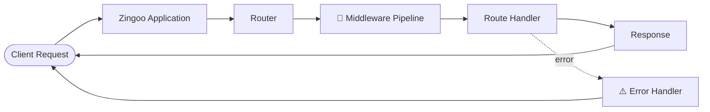

<div align="center">

<br/>


## 🚀 Zingoo v0.1.0 — Officially Launched

**Build More. Configure Less.**

Zingoo **v0.1.0** is now officially available on npm 🎉


### 📦 Install Zingoo

```bash
npm install zingoo
```

[](#)
[](#)
[](#)
[](#)
[](#)

<br/>

> The all-in-one Node.js framework for modern backend development

<br/>

### 📚 Documentation

**[Getting Started](#-quick-start)** · **[What's Shipped](#-whats-in-v010)** · **[Benchmarks](#-benchmarks)** · **[Core Concepts](#-core-concepts)** · **[API Reference](#-api-reference)** · **[Roadmap](#-roadmap)** · **[Contributing](#-contributing)**

</div>

---

<br/>

## 📖 Table of Contents

<details open>
<summary><b>Click to expand</b></summary>

- [What is Zingoo?](#-what-is-zingoo)
- [What's in v0.1.0](#-whats-in-v010)
- [Benchmarks](#-benchmarks)
- [Core Concepts](#-core-concepts)
  - [HTTP Server & Router](#-http-server--router)
  - [Middleware & Flow Control](#-middleware--flow-control)
  - [Request & Response Abstraction](#-request--response-abstraction)
  - [Body Parsing & Validation](#-body-parsing--validation)
  - [Security Defaults](#️-security-defaults)
  - [Error Handling](#-error-handling)
  - [Logging & DX](#-logging--dx)
- [Architecture](#️-architecture)
- [Quick Start](#-quick-start)
- [API Reference](#-api-reference)
- [Roadmap](#-roadmap)
- [Contributing](#-contributing)

</details>

<br/>

## 🌌 What is Zingoo?

Zingoo is a **modern, JavaScript-first Node.js HTTP framework** designed as a lean alternative to Express. It ships with routing, middleware, validation, security headers, CORS, rate limiting, and structured error handling — all with a clean, minimal API.

**v0.1.0 ships the core framework.** Future versions will add AI/LLM support as a first-class feature.

```diff
+ npm install zingoo
```

---

## ✨ What's in v0.1.0

<div align="center">

| ✅ Shipped | 🚧 Coming Soon |
|:---:|:---:|
| HTTP Server & Router | AI-Native Framework |
| Middleware System | Developer Experience Tooling |
| Request/Response APIs | Production & Performance Tooling |
| Body Parsing & Validation | Full Backend Platform |
| Security Defaults | Plugin Marketplace |
| Rate Limiting | Auto-generated CRUD |
| Testing Framework (44/44 ✅) | Observability Dashboard |
| Benchmarking (Autocannon) | Dedicated Benchmark Suite |

</div>

### 🎯 v0.1.0 Feature Checklist

#### 🌐 Core

- ✅ Application factory (`zingoo()`)
- ✅ Native Node `http` server
- ✅ Route registration (GET, POST, PUT, PATCH, DELETE, OPTIONS, HEAD)
- ✅ Generic route registration (`app.route()`)
- ✅ Static & dynamic routes
- ✅ Route parameters (`:id`, multiple params)
- ✅ Static route priority
- ✅ Global & router-level middleware
- ✅ Middleware `next()` chaining

#### 🔄 Request / Response

- ✅ Request abstraction layer
- ✅ Headers, query params, path, IP detection
- ✅ Route parameter extraction
- ✅ Response abstraction layer
- ✅ JSON responses, status codes
- ✅ Response helpers (e.g. `res.ok()`)

#### 📦 Body & Validation

- ✅ JSON body parser
- ✅ URL-encoded body parser
- ✅ Text body parser
- ✅ Configurable body size limits (`bodyLimit`)
- ✅ Invalid JSON error handling
- ✅ Built-in validation (`app.validate()`)

#### 🛡️ Security

- ✅ Security headers applied by default (no config needed)
- ✅ CORS configuration (`app.cors()`)
- ✅ Rate limiting (`app.rateLimit()`)

#### ⚠️ Errors

- ✅ `ZingooError` class
- ✅ Global error handler (`app.onError()`)
- ✅ Environment-aware responses (`setEnvironment`)

#### 🧪 Developer Experience

- ✅ Built-in logger
- ✅ Request logging
- ✅ Public API & examples
- ✅ **44/44 tests passing** ✅

---

## 📊 Benchmarks

Benchmarked with **Autocannon** — 100 connections, 10 seconds:

| Route | Requests/sec | Avg Latency |
|---|:---:|:---:|
| `GET /` | ~1,713 req/sec | ~57 ms |
| `GET /users/123` | ~1,465 req/sec | ~67 ms |

A dedicated benchmarking suite with Express/Fastify comparisons is planned for a future release (see [Roadmap](#-roadmap)).

<div align="center">


<br/><br/>


</div>

---

## 🧩 Core Concepts

<br/>

### 🌐 HTTP Server & Router

Create an app and register routes with a familiar API:

```js
import zingoo from "zingoo";

const app = zingoo();

app.get("/", (req, res) => {
  res.json({ message: "Welcome to Zingoo ⚡" });
});

app.post("/users", (req, res) => {
  const { name, email } = req.body;
  res.json({ id: 1, name, email });
});

app.listen(3000);
```

Supports all HTTP methods:

```js
app.get(path, handler);
app.post(path, handler);
app.put(path, handler);
app.patch(path, handler);
app.delete(path, handler);
app.options(path, handler);
app.head(path, handler);

// Generic registration
app.route(method, path, handler);
```

Dynamic route parameters:

```js
app.get("/users/:id", (req, res) => {
  const { id } = req.params;
  res.json({ user: { id } });
});

app.get("/posts/:postId/comments/:commentId", (req, res) => {
  const { postId, commentId } = req.params;
  res.json({ postId, commentId });
});
```

<br/>

### 🔄 Middleware & Flow Control

Register global middleware:

```js
app.use((req, res, next) => {
  console.log(`${req.method} ${req.path}`);
  next();
});

app.use((req, res, next) => {
  req.user = { id: 1 }; // Attach data to request
  next();
});
```

Route-scoped middleware:

```js
const requireAuth = (req, res, next) => {
  if (!req.headers.authorization) {
    return res.status(401).json({ error: "Unauthorized" });
  }
  next();
};

app.get("/profile", requireAuth, (req, res) => {
  res.json({ user: req.user });
});
```

Middleware runs in registration order and respects `next()`.

<br/>

### 🚀 Request & Response Abstraction

**Request object:**

```js
app.get("/search", (req, res) => {
  const query = req.query.q;           // Query params
  const method = req.method;           // HTTP method
  const path = req.path;               // Request path
  const headers = req.headers;         // Headers
  const ip = req.ip;                   // Client IP
  const body = req.body;               // Parsed body
  const { id } = req.params;           // Route params
});
```

**Response object:**

```js
app.get("/", (req, res) => {
  res.status(200);                     // Set status
  res.setHeader("X-Custom", "value");  // Set headers
  res.json({ data: "value" });         // JSON response
});

app.get("/health", (req, res) => {
  res.ok({ status: "healthy" });       // 200 helper
});
```

<br/>

### 📦 Body Parsing & Validation

Automatic body parsing for common content types:

```js
app.post("/users", (req, res) => {
  // req.body is automatically parsed
  const { name, email } = req.body;
  res.json({ name, email });
});
```

Supports:
- `application/json`
- `application/x-www-form-urlencoded`
- `text/plain`

Configurable size limits:

```js
const app = zingoo();
app.bodyLimit("10mb");
```

Built-in validation with `app.validate()`:

```js
app.post(
  "/users",
  app.validate({
    body: {
      name: { type: "string", required: true },
      email: { type: "string", required: true }
    }
  }),
  (req, res) => {
    res.json({ user: req.body });
  }
);
```

> Check `src/validator.js` for the exact schema syntax supported.

<br/>

### 🛡️ Security Defaults

Security headers are applied automatically — no configuration needed:

```js
const app = zingoo();
// Security headers are already active here
```

**Security headers** (enabled by default):
- `X-Content-Type-Options: nosniff`
- `X-Frame-Options: DENY`
- `Referrer-Policy: no-referrer`

**CORS:**

```js
app.cors({
  origin: "http://localhost:5173"
});

// or allow all origins
app.cors({
  origin: "*"
});
```

> Current CORS supports a single `origin` string plus `methods`/`headers` config. `credentials` is not yet implemented.

**Rate Limiting:**

```js
app.rateLimit({
  windowMs: 60 * 1000, // 1 minute
  max: 100             // 100 requests per window
});
```

<br/>

### ⚠️ Error Handling

Zingoo includes a `ZingooError` class for structured errors:

```js
import { ZingooError } from "zingoo";

app.get("/users/:id", (req, res) => {
  if (!req.params.id) {
    throw new ZingooError("User ID required", 400);
  }
  res.json({ id: req.params.id });
});
```

Global error handler:

```js
app.onError((err, req, res) => {
  console.error(err);
  res.status(err.status || 500);
  res.json({
    error: err.message,
    ...(process.env.NODE_ENV === "development" && { stack: err.stack })
  });
});
```

Environment-aware responses:

```js
app.setEnvironment("production");
// Development: returns full stack trace
// Production: returns safe message only
```

<br/>

### 🧪 Logging & DX

Built-in logger for debugging:

```js
app.use((req, res, next) => {
  console.log(`→ ${req.method} ${req.path}`);
  next();
});

// Output:
// → GET /users
// → POST /users
// → GET /users/1
```

---

## 🗺️ Architecture



<details>
<summary>📦 Package structure (v0.1.0)</summary>

```
zingoo
├── index.js
├── src/
│   ├── application.js
│   ├── router.js
│   ├── middleware.js
│   ├── request.js
│   ├── response.js
│   ├── body-parser.js
│   ├── validator.js
│   ├── validation-middleware.js
│   ├── cors.js
│   ├── security.js
│   ├── rate-limiter.js
│   ├── logger.js
│   ├── request-logger.js
│   ├── error-handler.js
│   └── errors.js
└── examples/
```

</details>

---

## 🚀 Quick Start

```bash
npm install zingoo
```

```js
import zingoo from "zingoo";

const app = zingoo();

// CORS
app.cors({
  origin: "*"
});

// Rate limiting
app.rateLimit({
  windowMs: 60 * 1000,
  max: 100
});

// Global middleware
app.use((req, res, next) => {
  console.log(`${req.method} ${req.path}`);
  next();
});

// Routes
app.get("/", (req, res) => {
  res.json({ message: "Welcome to Zingoo ⚡" });
});

app.post("/api/users", (req, res) => {
  const { name, email } = req.body;
  res.status(201);
  res.json({ id: 1, name, email });
});

app.get("/api/users/:id", (req, res) => {
  const { id } = req.params;
  res.json({ id, name: "Alice", email: "alice@example.com" });
});

// Start server
app.listen(3000, () => {
  console.log("Zingoo server running on http://localhost:3000");
});
```

```bash
node server.js
```

---

## 🧾 API Reference

<details>
<summary><b>Expand full reference</b></summary>

### Application

| Method | Signature | Description |
|---|---|---|
| `zingoo()` | `zingoo()` | Create app instance |
| `app.listen()` | `(port, callback?)` | Start HTTP server |
| `app.use()` | `(middleware)` | Register global middleware |
| `app.cors()` | `(options)` | Configure CORS |
| `app.rateLimit()` | `(options)` | Configure rate limiting |
| `app.validate()` | `(schema)` | Built-in validation middleware |
| `app.bodyLimit()` | `(limit)` | Set request body size limit |
| `app.setEnvironment()` | `(env)` | Set `development` / `production` mode |
| `app.onError()` | `(handler)` | Register global error handler |

### Routing

| Method | Signature | Description |
|---|---|---|
| `app.get()` | `(path, handler)` | Register GET route |
| `app.post()` | `(path, handler)` | Register POST route |
| `app.put()` | `(path, handler)` | Register PUT route |
| `app.patch()` | `(path, handler)` | Register PATCH route |
| `app.delete()` | `(path, handler)` | Register DELETE route |
| `app.options()` | `(path, handler)` | Register OPTIONS route |
| `app.head()` | `(path, handler)` | Register HEAD route |
| `app.route()` | `(method, path, handler)` | Generic route registration |

### Request

| Property | Type | Description |
|---|---|---|
| `req.method` | `string` | HTTP method |
| `req.path` | `string` | Request path |
| `req.query` | `object` | Query parameters |
| `req.params` | `object` | Route parameters |
| `req.headers` | `object` | HTTP headers |
| `req.body` | `any` | Parsed body |
| `req.ip` | `string` | Client IP address |

### Response

| Method | Signature | Description |
|---|---|---|
| `res.status()` | `(code)` | Set HTTP status |
| `res.json()` | `(data)` | Send JSON response |
| `res.ok()` | `(data)` | Send a 200 JSON response |
| `res.setHeader()` | `(name, value)` | Set response header |
| `res.end()` | `()` | End response |

### Error Handling

| Class | Description |
|---|---|
| `ZingooError` | Custom error class with status code |

```js
throw new ZingooError("User not found", 404);
```

</details>

---

## 🧭 Roadmap

<div align="center">

### v0.1 ✅ COMPLETE
**Core Web Framework**

### v0.2 🚧 IN PROGRESS
**AI-Native Framework**

### v0.3 ⏳ PLANNED
**Developer Experience**

### v0.4 ⏳ PLANNED
**Production & Performance**

### v0.5 ⏳ PLANNED
**Full Backend Platform**

### v1.0 ⏳ PLANNED
**Launch / Ecosystem**


## 🚀 Running Tests

```bash
npm test
```

**Status:** 44/44 tests passing ✅


---

## 📄 License

MIT — See LICENSE file

---

<div align="center">


**v0.1.0 shipped. v0.2 (AI-Native) coming soon.**

**Where Express ends, Zingoo begins.**

</div>
