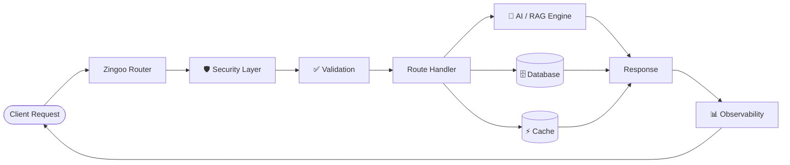

<div align="center">


<br/>


<br/>

[](#)
[](#)
[](#)
[](#)
[](#)

</div>

<br/>

<table align="center">
<tr>
<td>

> **TL;DR** — Zingoo replaces the usual 5–10 package stack (router, auth, validation, rate-limit, logging, AI SDK, RAG, observability) with **one framework**. TypeScript-first. Secure by default. AI-native from the ground up.

</td>
</tr>
</table>

<div align="center">

### 📚 Documentation

**[Getting Started](#-quick-start)** · **[Core Concepts](#-the-10-pillars)** · **[Architecture](#️-architecture)** · **[API Reference](#-api-cheat-sheet)** · **[Roadmap](#-roadmap)** · **[Contributing](#-contributing)**

</div>

---

<br/>

## 📖 Table of Contents

<details open>
<summary><b>Click to expand</b></summary>

- [What is Zingoo?](#-what-is-zingoo)
- [Feature Constellation](#-feature-constellation)
- [The 10 Pillars](#-the-10-pillars)
  - [1. AI / LLM Support](#-1-built-in-ai--llm-support)
  - [2. Automatic API Docs](#-2-automatic-api-documentation)
  - [3. Security by Default](#️-3-security-by-default)
  - [4. Observability](#-4-built-in-observability)
  - [5. Performance Mode](#-5-performance-mode)
  - [6. Plugin Ecosystem](#-6-plugin-ecosystem)
  - [7. Database-Aware APIs](#️-7-database-aware-apis)
  - [8. Automatic Testing](#-8-automatic-testing)
  - [9. Hot Reload / Dev Mode](#-9-hot-reload--dev-mode)
  - [10. TypeScript-First](#-10-typescript-first)
- [Architecture](#️-architecture)
- [Quick Start](#-quick-start)
- [API Cheat Sheet](#-api-cheat-sheet)
- [Roadmap](#-roadmap)
- [Contributing](#-contributing)

</details>

<br/>

## 🌌 What is Zingoo?


Zingoo is a **TypeScript-first, AI-native backend framework** for Node.js. It ships the entire modern backend stack out of the box:

```
Zingoo
 ├── API
 ├── Auth
 ├── Validation
 ├── Rate limiting
 ├── Logging
 ├── AI
 ├── RAG
 └── Observability
```

Go from `npm install` to a secured, documented, AI-capable API in minutes — not weeks.

```diff
+ npm install zingoo
```

<br clear="right"/>

---

## ✨ Feature Constellation

<div align="center">

| 🧠 | 🔥 | 🛡️ | 📊 |
|:---:|:---:|:---:|:---:|
| **AI-Native** | **Auto Docs** | **Secure by Default** | **Observability** |
| Built-in LLM + RAG | Live `/api/docs` | Headers, CORS, JWT | `/metrics` `/health` |

| ⚡ | 🧩 | 🗄️ | 🧪 |
|:---:|:---:|:---:|:---:|
| **Performance Mode** | **Plugin Ecosystem** | **Resource APIs** | **Auto Testing** |
| Pooling & caching | `zingoo-*` plugins | Instant CRUD | Zero-config suite |

</div>

---

## 🧩 The 10 Pillars

<br/>

### 🧠 1. Built-in AI / LLM Support

<table>
<tr><td>

Zingoo's biggest differentiator — AI isn't a plugin, it's core.

```ts
const app = zingoo();

app.ai({
  provider: "openai",
  model: "gpt-5"
});

app.post("/ask", async (req, res) => {
  const answer = await app.ai.ask(req.body.question);
  res.json({ answer });
});
```

Scale up to full **RAG pipelines** in one line:

```ts
app.rag({
  vectorStore: "chroma",
  embeddings: "minilm"
});
```

</td></tr>
</table>

> 🚀 Zingoo becomes a modern **AI-native backend framework** — not a router with an SDK bolted on.

<details>
<summary>💡 Why this matters</summary>
<br/>

Most frameworks treat AI as an afterthought — you wire in the OpenAI SDK yourself, manage streaming manually, and build your own RAG plumbing. Zingoo treats `app.ai` and `app.rag` as first-class citizens, the same way Express treats routing.

</details>

<br/>

### 🔥 2. Automatic API Documentation

No more hand-writing Swagger/OpenAPI specs.

```ts
app.get("/users/:id", {
  response: UserSchema
}, async (req, res) => {
  // ...
});
```

Auto-generated, live and interactive:

| Endpoint | Description |
|---|---|
| `/api/docs` | Interactive API explorer |
| `/openapi.json` | Full OpenAPI spec |

<br/>

### 🛡️ 3. Security by Default

Stop remembering `helmet`, `cors`, `rate-limit`, `csrf`, `sanitize-html`...

```ts
const app = zingoo({
  security: "strict"
});
```

<div align="center">

| Protection | Status |
|---|:---:|
| Security headers | ✅ |
| Request size limits | ✅ |
| Rate limiting | ✅ |
| Input validation | ✅ |
| CORS protection | ✅ |
| Error sanitization | ✅ |
| Request timeout | ✅ |
| JWT utilities | ✅ |

</div>

> **Philosophy:** Secure by default. Configurable when needed.

<br/>

### 📊 4. Built-in Observability

Production insight without wiring a separate stack.

```ts
app.observe({
  metrics: true,
  tracing: true
});
```

```
╭──────────────────────────────╮
│        Zingoo Dashboard       │
├──────────────────────────────┤
│ Requests        12,421        │
│ Error Rate       0.31%        │
│ P95                84ms       │
├──────────────────────────────┤
│ Slow APIs                     │
│   GET  /users        421ms    │
│   POST /payment      389ms    │
╰──────────────────────────────╯
```

Auto-exposed: `/metrics` · `/health` · `/ready`

<br/>

### ⚡ 5. Performance Mode

```ts
const app = zingoo({
  mode: "performance"
});
```

Unlocks request pooling, response compression, caching, connection reuse, route optimization, and async execution tuning.

<div align="center">

| Framework | Requests/sec |
|---|---:|
| Express | `TBD` |
| Fastify | `TBD` |
| Hono | `TBD` |
| **Zingoo** | `TBD` |

<sub>⚠️ Benchmarks pending — superiority claims wait for real numbers.</sub>

</div>

<br/>

### 🧩 6. Plugin Ecosystem

```ts
app.plugin(authPlugin);
app.plugin(redisPlugin);
app.plugin(ragPlugin);
app.plugin(paymentPlugin);
```

<div align="center">

`zingoo-auth` • `zingoo-redis` • `zingoo-rag` • `zingoo-stripe` • `zingoo-ai` • `zingoo-postgres` • `zingoo-mongodb`

</div>

A growing ecosystem, built around a tiny core.

<br/>

### 🗄️ 7. Database-Aware APIs

Skip repetitive CRUD boilerplate:

```ts
app.resource("users", {
  model: User
});
```

Instantly generates, fully validated and paginated:

```
GET    /users
GET    /users/:id
POST   /users
PUT    /users/:id
DELETE /users/:id
```

<sub>Fully optional — Zingoo never forces opinions on you.</sub>

<br/>

### 🧪 8. Automatic Testing

```ts
app.test();
```

Zingoo discovers your routes and scaffolds a test suite automatically:

```ts
test("GET /users", async () => {
  const response = await app.request("/users");
  expect(response.status).toBe(200);
});
```

<br/>

### 🔄 9. Hot Reload + Dev Mode

```bash
zingoo dev
```

```
✓ Server started
✓ Routes detected: 24
✓ Database connected
✓ Redis connected

────────────────────────────────
   Zingoo Dev Mode
────────────────────────────────
   Local:    http://localhost:3000
   Docs:     http://localhost:3000/api/docs
   Metrics:  http://localhost:3000/metrics
────────────────────────────────
```

<br/>

### 🧬 10. TypeScript-First

Type-safe from **route → request → validation → database → response**.

```ts
const User = schema.object({
  name: schema.string(),
  email: schema.email(),
  age: schema.number()
});

app.post("/users", {
  body: User
}, async ({ body }) => {
  // body is automatically typed ✨
});
```

---

## 🗺️ Architecture



<details>
<summary>📦 Modular package layout</summary>

```
@zingoo/core
@zingoo/router
@zingoo/http
@zingoo/security
@zingoo/auth
@zingoo/validation
@zingoo/database
@zingoo/redis
@zingoo/ai
@zingoo/rag
@zingoo/observability
@zingoo/testing
@zingoo/cli
```

`npm install zingoo` gives you the standard bundle. Advanced users can install individual `@zingoo/*` modules directly.

</details>

---

## 🚀 Quick Start

```bash
npm install zingoo
```

```ts
import zingoo from "zingoo";

const app = zingoo({
  security: "strict",
  mode: "performance"
});

app.ai({ provider: "openai", model: "gpt-5" });
app.observe({ metrics: true, tracing: true });

app.get("/", (req, res) => {
  res.json({ message: "Welcome to Zingoo ⚡" });
});

app.listen(3000);
```

```bash
zingoo dev
```

---

## 🧾 API Cheat Sheet

<details>
<summary><b>Expand full reference</b></summary>

| Method | Signature | Description |
|---|---|---|
| `zingoo()` | `zingoo(options?)` | Create an app instance |
| `app.get/post/put/delete()` | `(path, [schema], handler)` | Define a route |
| `app.use()` | `(middleware)` | Register middleware |
| `app.ai()` | `({ provider, model })` | Enable the AI engine |
| `app.rag()` | `({ vectorStore, embeddings })` | Enable RAG pipeline |
| `app.observe()` | `({ metrics, tracing })` | Enable observability |
| `app.resource()` | `(name, { model })` | Generate CRUD routes |
| `app.plugin()` | `(plugin)` | Register a plugin |
| `app.test()` | `()` | Auto-generate test suite |
| `app.listen()` | `(port)` | Start the server |

</details>

---

## 🧭 Roadmap

<div align="center">

`✅ Core Router` → `✅ Security Defaults` → `🚧 AI Engine` → `🚧 RAG Pipelines` → `⏳ Plugin Marketplace` → `⏳ Zingoo Cloud`

</div>

| Version | Focus | Status |
|---|---|:---:|
| `v0.1` | Core — HTTP, router, middleware, errors | 🚧 |
| `v0.2` | Type safety & validation |  🚧 |
| `v0.3` | AI-native layer | ⏳ |
| `v0.4` | Security & auth | ⏳ |
| `v0.5` | Database layer | ⏳ |
| `v0.6` | Production (logging, health, graceful shutdown) | ⏳ |
| `v0.7` | DX & CLI (`zingoo dev/build/start`) | ⏳ |
| `v1.0` | Plugin ecosystem, benchmarks, docs | ⏳ |

---

```bash
git clone https://github.com/<your-username>/zingoo.git
cd zingoo
npm install
npm run dev
```


<div align="center">


**Where Express ends, Zingoo begins.**

</div>
